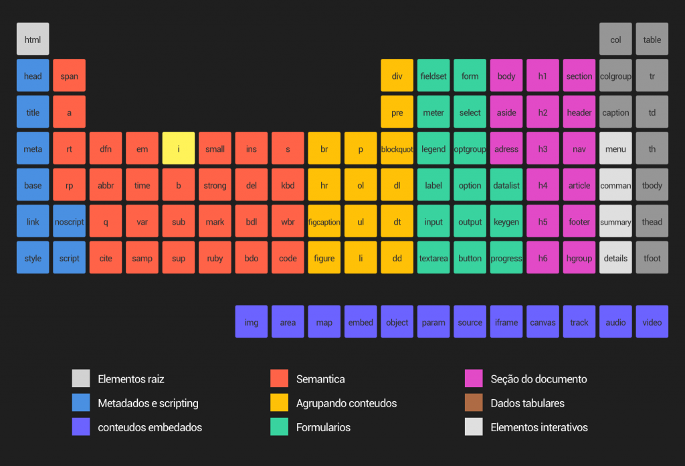

# site-de-receitas-arquitetura-css-
Projeto sobre arquitetura de CSS: Descomplicando os problemas

O site é responsivo, se adaptando às alterações. Será possível acessá-lo de maneira agradável mesmo em um celular, tablet ou desktop. Para o desenvolvimento desse site usaremos a metodologia Atomic Design, com a qual organizaremos e arquitetaremos nosso projeto de maneira mais eficiente e de fácil manutenção.

O Atomic Design é uma metodologia desenvolvida por Brad Frost para a criação de design systems. Ela é composta por cinco estágios, trabalhando juntos para criar interfaces de maneira deliberada e hierárquica. Os cinco estágios do Atomic Design são: átomos, moléculas, organismos, modelos e paginas.

Essa é a essência básica do Atomic Design. O Atomic Design é uma metodologia composta por cinco estágios distintos, trabalhando juntos para criar sistemas de design de interface de maneira mais deliberada e hierárquica. Os cinco estágios do Atomic Design são:

Átomos são os blocos básicos de construção da matéria. Aplicados às interfaces da web, os átomos são nossas tags HTML/componentes básicos, uma imagem de perfil, um label de formulário, um campo de texto ou um botão.

Moléculas: são grupos relativamente simples de elementos da interface que funcionam juntos como uma unidade. Por exemplo, uma imagem de perfil, um label, um card e botão podem se combinar em um card de informação do usuário.

Organismos são componentes de interface relativamente complexos compostos por grupos de moléculas e/ou átomos e/ou outros organismos. Um exemplo uma lista, composta de cards com imagem de perfil e nome.

Modelos colocam componentes em um layout e demonstram a estrutura de conteúdo subjacente do design.

Páginas aplicam conteúdo real aos modelos e articulam variações para demonstrar a interface do usuário final e testar a resiliência do sistema de design.

Referencia da pagina para mais informação: https://vidadeproduto.com.br/atomic-design/

Propriedades shorthand

Definição
Propriedades shorthand (tradução literal: Propriedades abreviadas) são propriedades de CSS que deixam você setar os valores de outras propriedades de CSS simultaneamente. Usando shorthand property, um desenvolvedor web pode escrever folhas de estilo mais concisas e legíveis,economizando tempo e energia.

A especificação CSS define como shorthand properties, o grupo de propriedades com o mesmo tema. Ex: a propriedade CSS background é uma propriedade shorthand que é capaz de definir o valor de background-color, background-image (en-US), background-repeat (en-US), e background-position. Assim também,como as propriedades comuns e relacionadas a fonte podem ser definidas e usadas com o shorthand font (en-US),e os diferentes margins em volta de um box podem ser definidas com o shorthand margin.

Referencia da pagina para mais informação: https://developer.mozilla.org/pt-BR/docs/Web/CSS/Shorthand_properties 